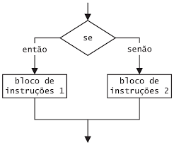

## 4 SE...ENTAO...SENAO    
O SE é uma estrutura condicional utilizada em algoritmos e programação, basicamente é utilizado para verificar se algo, ou uma variável é uma coisa ou outra.

### 4.1 O que é uma condicional?
Para grande parte dos algoritmos que criamos precisamos fazer verificações para tomar decisões no código. As estruturas condicionais, nesse caso o SE, nos ajudam com isso. A condicional basicamente verifica uma operação lógica que retorna **Verdadeiro** ou **Falso**. 

Por exemplo:  
  
    ```
        SE(<expressão booleana>) 
           ENTÃO
               <caso o resultado seja verdadeiro executa uma ação>
    ```

### 4.2 Fluxo
No SE ou uma ação é feita ou outra:




### 4.3 Estrutura do SE
Para as aulas de algoritmo há uma padrão de escrita a ser seguido, caso esteja fora do padrão os professores tiram nota. A estrutura

```
SE (expressão booleana)
     ENTÃO
          <ação a ser executada se a condição for verdadeira>
SENÃO
     ENTÃO
          <ação a ser executada se a condição for falsa>
FIMSE
```
🧾 Explicação de cada parte:

- **SE(condição)***: Aqui vai a condição lógica que será avaliada. Por exemplo, nota >= 7.
- **ENTÃO**: Indica o bloco de comandos que será executado se a condição for verdadeira.
- **SENÃO**: Indica que o próximo bloco será executado se a condição for falsa.
- **FIMSE**: Marca o fim da estrutura condicional.

Para a estrutura condicional o SENAO não é obrigatório, a casos que só há uma opção de execução, onde não é necessário um SENAO. Nesses casos quando não entra no SE, o algoritmo não faz nada, só continua a execução

### 4.6 Exemplo de algoritmo utilizando SE
Sem o SENAO:

```
INICIO
    LOGICO: MaiorDeIdade;
    MaiorDeIdade <- Verdadeiro;
    
    SE(MaiorDeIdade)
        ENTAO
            ESCREVA("É maior de idade");
    FIMSE
FIM
```
Entrada: Verdadeiro;
Saida: "É maior de idade"

Entrada: Falso;
Saida: 

Com SENAO:

```
INICIO
    INTEIRO: Idade;
    Idade <- 18;
    
    SE(Idade>=18)
        ENTAO
            ESCREVA("É maior de idade");
    SENAO
            ESCREVA("É menor de idade");
    FIMSE
FIM
```
``Entrada``: 18;

``Saida``: "É maior de idade"

Entrada: 13;

``Saida``: "É menor de idade"

### 4.7 SE aninhado
Para algoritmos mais complexos, que hajam mais de uma verificação, pode ser necessário que hajam SE's aninhados para que todos os casos sejam verificados. Podemos usar um SE aninhado quando a primeira condição é verdadeira, mas ainda precisamos fazer outra verificação, ou outras. Ou quando a condição é falsa, mas queremos verificar outro ou outros casos antes de decidir o que fazer. É importante lembrar que para cada SE aberto é necessário ter um FIMSE, mesmo os SE's que estão dentro de outros.

### 4.8 Exemplo de SE aninhado
```
SE(nota >= 7)
     ENTÃO
          Escreva("Aluno aprovado")
SENÃO
     SE(nota >= 5)
        ENTÃO
            Escreva("Aluno em recuperação")      
     SENÃO
        Escreva("Aluno reprovado")
     FIMSE
FIMSE

```


